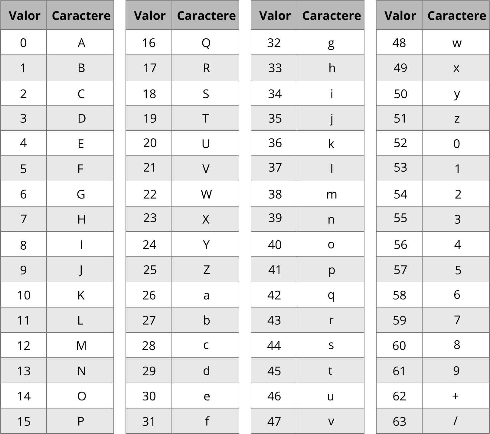

# Base64

Agora que você já teve contato com o código ASCII, vamos conhecer o **Base64**, um método para codificar e decodificar dados binários em caracteres ASCII.

Esse método é utilizado frequentemente para transferir dados em meios que só suportam formatos ASCII, por exemplo, enviar anexos por e-mail (que usa o [MIME](https://pt.wikipedia.org/wiki/MIME)).

O nome base64 origina-se do fato de que esse sistema é constituido de 64 caracteres, representando exatamente 6 bits de dados. Com isso, três bytes de 8 bits podem ser representados por 4 digitos de 6 bits em base64.

A tabela abaixo mostra a equivalência entre os valores de um conjunto de 6 bits e os caracteres usados para codificação.



Quando os bits da mensagem original não são multiplos de 6, são adicionados zeros como _padding_. Assim, na mensagem codificada é colocado um `=` para cada dois zeros de _padding_. Aliás, esse `=` é uma forma bem comum de reconhecer um texto codificado em base64.

Abaixo está um exemplo de um texto codificado em base64:

```
texto:          M        |        a        |        n
8 bits:  0 1 0 0 1 1 0 1 | 0 1 1 0 0 0 0 1 | 0 1 1 0 1 1 1 0
6 bits:  0 1 0 0 1 1 | 0 1 0 1 1 0 | 0 0 0 1 0 1 | 1 0 1 1 1 0       
Valor:        19     |      22     |      5      |      46
texto:        T      |      W      |      F      |      u
(base64)
```
E se tirarmos o `n`, a codificação vai necessitar de um _padding_:
```
texto:          M        |        a        |  
8 bits:  0 1 0 0 1 1 0 1 | 0 1 1 0 0 0 0 1 |  
6 bits:  0 1 0 0 1 1 | 0 1 0 1 1 0 | 0 0 0 1 0 0 | 0 0 0 0 0 0      
Valor:        19     |      22     |      5      |  (padding)
texto:        T      |      W      |      E      |      =
(base64)
```
## Exercícios

[Decodifique essa mensagem](../../challenges/training/encodings/base64.md)
